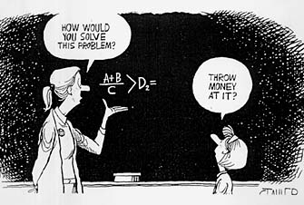
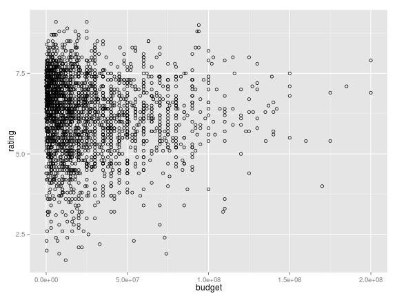

## The Question:

It seems that human nature is to try to fix problems with money.  Does it work for the movie industry?

Let's take a look!

---&radio

## What's your inclination?

Are big-budget movies always better?

1. Always
2. Never
3. Sometimes
4. _We can find out_

*** .hint

We don't know, it's only slide 2

*** .explanation

There's an app for that.

---

## The numbers

 

This is a chart of budget versus income for all movies 1969-2005.  Just by looking at this graph it appears that higher budgets only guarantee "not really really horrible"

---

## The App
My app located at https://max-wen.shinyapps.io/App4/ allows us to analyze in more detail the relation between budget and quality.  It uses the 'movies' data set in ggplot which pulls ratings from imdb.com.  Over 55,000 movies are in the set, however it's been reduced for our use by only including movies with budget greater than zero and released since 1969.

Users can specify a time period to examine and may also subset based on genre.  It does stand to reason that the effects of budget are not the same for a comedy as they are for a special effects-laden action movie.

The output is a scatterplot of the data based on the user subset selections.  A regression line is added to show the trend of the data.

---

## Check it out

I hope you find it as interesting as I did.

